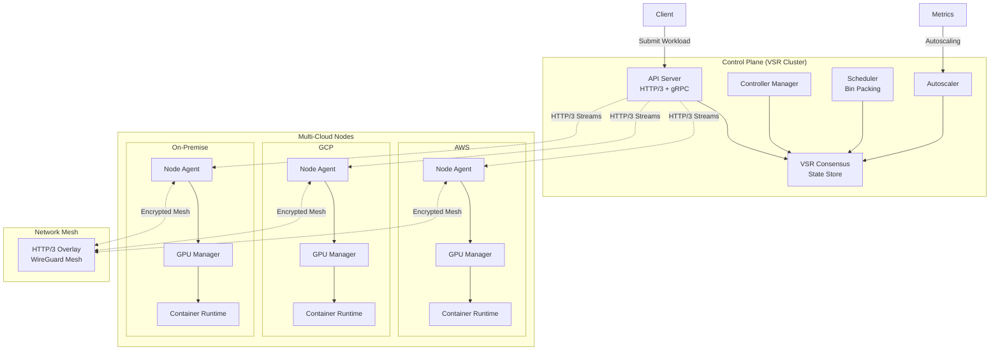
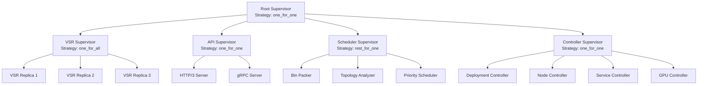
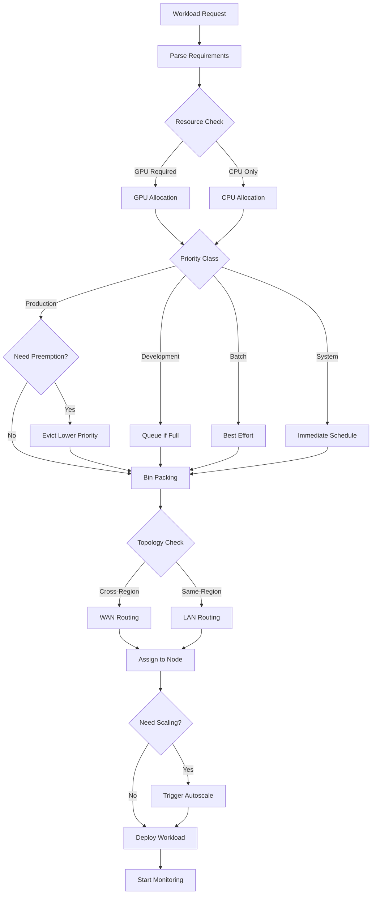
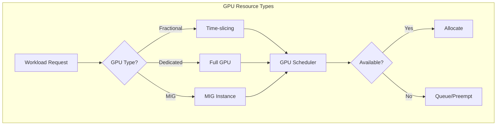
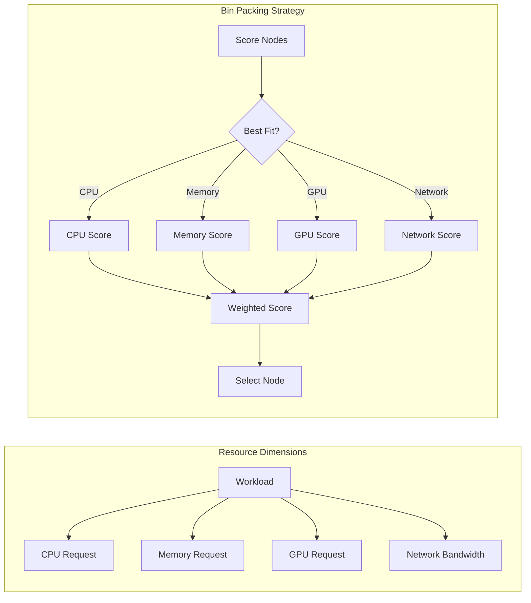
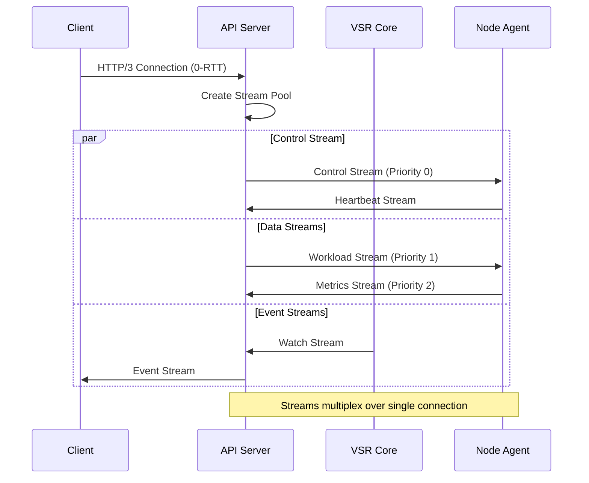
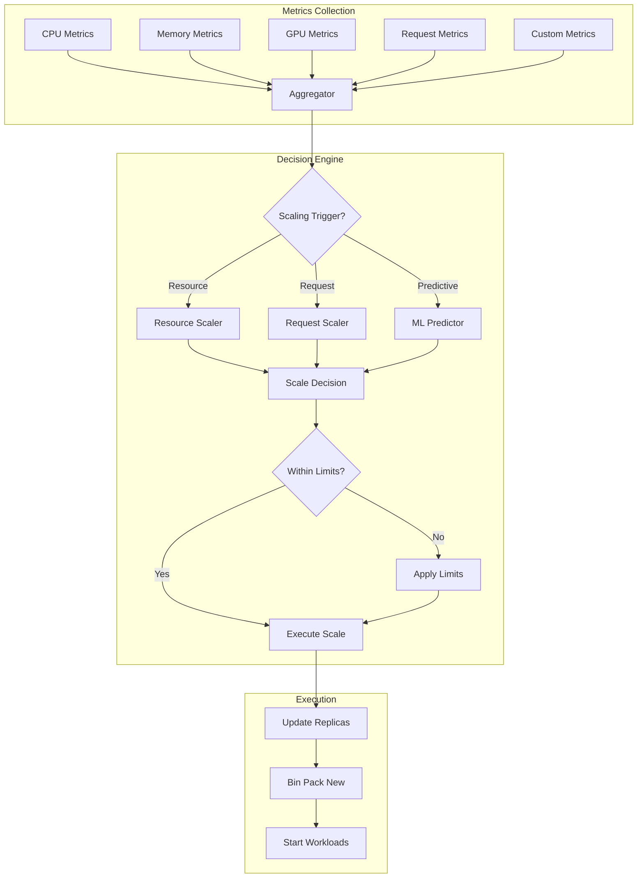
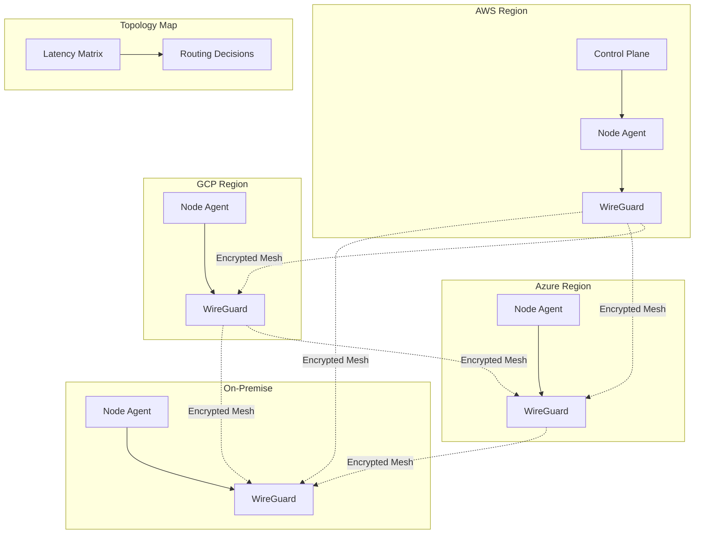
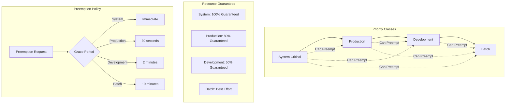

<div align="center">

# Hivemind Vision


</div>

> **Note**: This document describes the long-term aspirational vision for Hivemind - a ground-up deterministic orchestration system built in Zig. For the current practical architecture and 6-month implementation plan, see [ARCHITECTURE.md](ARCHITECTURE.md).

---

## Overview

Hivemind is a deterministic workload orchestration system designed as a focused alternative to Kubernetes. It emphasizes simplicity, performance, and deterministic testing.

**Key Innovation**: Hivemind consists of two interconnected systems:
1. **The Production Orchestrator**: A real distributed system that manages workloads across nodes
2. **The Hivemind-VOPR Simulator**: A deterministic testing harness that can simulate the entire orchestrator's behavior with perfect reproducibility

This dual nature, allows us to test complex distributed scenarios with mathematical certainty while building a production-ready system.

### System Architecture Overview



## Lessons from TigerBeetle

While TigerBeetle's VOPR scheduler is designed for testing a database, not for orchestrating workloads, we adopt several key principles:

### What We Adopt
- **VSR Consensus**: Using Viewstamped Replication as our core consensus mechanism
- **Deterministic Simulation Philosophy**: Building a parallel simulator for our orchestrator
- **Static Allocation**: Bounded resources and queues throughout the system
- **Single-threaded Core Logic**: Simplifying controller logic by avoiding concurrent mutations
- **Comprehensive Assertions**: Extensive runtime checks that fail fast

### What We Don't Use
- **The VOPR Scheduler Itself**: It's a test harness, not a production scheduler
- **Virtual Time in Production**: Real orchestrators must use wall-clock time
- **Hermetic Environment**: Production must handle real network and hardware chaos

## Architecture Layers

### Physical Layer (Production)
- Runs on real hardware across distributed data centers
- Uses real network with actual latency and partitions
- Interacts with real container runtimes (containerd, CRI-O)
- Handles real-time events and wall-clock scheduling

### Simulation Layer (Testing)
- Runs entire cluster on a single thread
- Replaces network with deterministic packet simulator
- Mocks container runtime with state transitions
- Controls time advancement explicitly
- Uses seeded PRNG for reproducible fault injection

### Abstraction Interface
Components are designed with pluggable backends:
```zig
const Network = if (is_simulation) SimulatedNetwork else RealNetwork;
const Storage = if (is_simulation) SimulatedStorage else RealStorage;
const Time = if (is_simulation) SimulatedTime else RealTime;
```

## Core Components

### Consensus Layer (VSR Core)
- **Replicated State Machine**: The brain of the cluster, storing desired state
- **VSR Protocol**: Viewstamped Replication for consensus (alternative to Raft/etcd)
- **State Store**: Persistent, consistent storage of cluster configuration
- **Journal**: Write-ahead log for durability and recovery

### Control Plane
- **API Server**: HTTP/3 + gRPC interface for cluster operations
- **Controller Manager**: Hosts all reconciliation controllers
  - Deployment Controller: Manages workload replicas with autoscaling
  - Node Controller: Monitors node health across clouds/datacenters
  - Service Controller: Manages network services with topology awareness
  - GPU Controller: Manages GPU resource allocation and sharing
  - Autoscale Controller: Handles resource and request-based scaling
  - Preemption Controller: Manages workload priorities and preemption
- **Scheduler Core**: Advanced placement with bin packing
  - GPU-aware scheduling with fractional allocation
  - Topology-aware placement (region, zone, rack)
  - Priority-based preemption
  - Bin packing optimization
- **Watch Manager**: Distributes state changes to controllers

### Data Plane
- **Node Agent** (hivemind-agent): Runs on each worker node
  - HTTP/3 communication with control plane
  - Manages local container runtime
  - Reports node status, metrics, and GPU availability
  - Handles GPU time-slicing and MIG partitioning
- **Container Runtime Interface**: Abstraction over containerd/CRI-O
- **Network Plugin**: HTTP/3-based overlay with topology awareness
- **GPU Manager**: NVIDIA/AMD GPU virtualization and sharing
- **Storage Plugin**: CSI-compatible volume management

### Network Layer (Transport Core)
- QUIC + HTTP/3 for control/data streams from the start
- Stream Management: Independent streams per purpose (control, data, metrics)
- Connection Migration: Seamless failover and mobility
- 0-RTT Resumption: Fast reconnection for mobile nodes
- Topology Router: Region-aware request routing

### Message Bus
- **Packet Router**: Stream-based routing (HTTP/2 in Phase 1; HTTP/3 in Phase 2)
- **Message Pool**: Static allocation of message buffers
- **Backpressure Manager**: Stream-level flow control

## Controller Architecture (Actor-Based)

### Actor-Based Controllers

Each controller is an isolated actor with its own mailbox and supervisor:

```zig
const ControllerActor = struct {
    actor: *Actor,
    supervisor: *Supervisor,
    state_store: *VSRClient,
    work_queue: BoundedQueue(WorkItem, 1000),
    
    fn init(supervisor: *Supervisor, state_store: *VSRClient) !*ControllerActor {
        const controller = try allocator.create(ControllerActor);
        controller.* = .{
            .actor = try Actor.spawn(ControllerState, .{}, supervisor),
            .supervisor = supervisor,
            .state_store = state_store,
            .work_queue = BoundedQueue(WorkItem, 1000).init(),
        };
        
        // Start message loop
        try controller.run();
        return controller;
    }
    
    fn run(self: *ControllerActor) !void {
        while (true) {
            const msg = try self.actor.receive();
            
            // Process message - crash on errors, supervisor will restart
            switch (msg) {
                .reconcile => try self.reconcile(msg.reconcile),
                .watch_event => try self.handle_watch(msg.watch_event),
                .health_check => try self.respond_healthy(),
                else => return error.UnexpectedMessage, // Crash!
            }
        }
    }
};
```

### Message-Driven Reconciliation

Controllers receive state changes as messages:

```zig
fn reconcile(self: *ControllerActor, event: ReconcileEvent) !void {
    const desired = try self.state_store.get(event.key);
    const actual = try self.get_actual_state(event.key);
    
    // Let it crash on invalid states
    if (!self.validate_state(desired)) {
        return error.InvalidDesiredState;
    }
    
    // Happy path only - no defensive coding
    if (!matches(desired, actual)) {
        const actions = try self.compute_actions(desired, actual);
        for (actions) |action| {
            // Bounded queue provides natural backpressure
            try self.work_queue.push_bounded(action);
            
            // Send action to appropriate actor
            const target = try self.registry.lookup(action.target);
            try target.send(.{ .execute = action });
        }
    }
}
```

### Bounded Work Queues with Backpressure
- Fixed-size queues per controller (e.g., 1000 items max)
- When queue fills, controller crashes (supervisor restarts with backoff)
- Natural flow control emerges from supervision tree
- Forces prioritization of important work

### Idempotent Operations
All controller actions are idempotent:
- Creating an existing resource is a no-op
- Deleting a missing resource succeeds
- Updates are based on resource generation/version
- Actions can be safely retried after crashes

## Design Decisions

### Why Zig?
- Compile-time guarantees and metaprogramming
- Predictable performance without hidden costs
- Excellent C interop for system programming (GPU libraries)
- First-class error handling
- Comptime abstractions for simulation/production modes
- New `Io` interface (Zig 0.16) perfect for deterministic I/O abstraction

#### Leveraging Zig 0.16’s `Io` interface

The `Io` interface in Zig 0.16 is particularly well-suited for Hivemind's dual-mode architecture (production vs simulation). This addresses the "Writergate" issue where the old `Writer` interface forced hidden allocations through its `print` method.

```zig
// Old problematic pattern (pre-0.16 `Io`)
fn oldWrite(writer: anytype, data: []const u8) !void {
    // Writer.print could allocate behind the scenes
    try writer.print("Data: {s}\n", .{data}); // Hidden allocation!
}

// New Io pattern for Hivemind (0.16+)
pub const NetworkIo = struct {
    const Self = @This();
    
    // Unified interface for both production and simulation
    vtable: if (build_options.is_simulation) SimulationVTable else ProductionVTable,
    
    const ProductionVTable = struct {
        // Direct syscalls, no allocations
        sendFn: *const fn (fd: os.fd_t, buf: []const u8) os.SendError!usize,
        recvFn: *const fn (fd: os.fd_t, buf: []u8) os.RecvError!usize,
    };
    
    const SimulationVTable = struct {
        // Deterministic simulation with packet tracking
        sendFn: *const fn (packet: *Packet, buf: []const u8) Error!usize,
        recvFn: *const fn (packet: *Packet, buf: []u8) Error!usize,
    };
    
    // No hidden allocations - explicit about every byte
    pub fn send(self: *Self, buf: []const u8) !usize {
        return self.vtable.sendFn(self.handle, buf);
    }
    
    // Caller controls all memory
    pub fn recv(self: *Self, buf: []u8) !usize {
        return self.vtable.recvFn(self.handle, buf);
    }
};
```

**Key Benefits for Hivemind:**

1. **No Hidden Allocations**: The new `Io` interface doesn't have `print` or other formatting methods that allocate. This aligns perfectly with our static allocation principle.

2. **Explicit Memory Control**: All buffers are provided by the caller, ensuring our bounded memory pools are respected:
   ```zig
   const MessagePool = struct {
       // Pre-allocated at startup
       buffers: [1024][4096]u8,
       
       pub fn write(self: *MessagePool, io: *NetworkIo, msg: Message) !void {
           const buf = self.buffers[msg.slot];
           const n = msg.encode(buf);  // No allocation
           _ = try io.send(buf[0..n]); // No allocation
       }
   };
   ```

3. **Clean Simulation/Production Split**: The vtable pattern allows us to swap implementations at compile time without runtime overhead:
   ```zig
   pub fn createNetworkIo() NetworkIo {
       return .{
           .vtable = if (comptime build_options.is_simulation)
               .{ .sendFn = simSend, .recvFn = simRecv }
           else
               .{ .sendFn = tcpSend, .recvFn = tcpRecv },
       };
   }
   ```

4. **Deterministic Testing**: In simulation mode, we can track every byte without worrying about hidden allocations disrupting our deterministic replay:
   ```zig
   fn simSend(packet: *Packet, buf: []const u8) Error!usize {
       // Every byte is accounted for
       packet.capture(buf);  // For replay
       if (simulator.should_drop(packet)) return error.PacketLoss;
       simulator.schedule_delivery(packet, buf);
       return buf.len;
   }
   ```

This new interface is a perfect fit for Hivemind's requirements: zero hidden allocations, complete control over memory, and clean abstraction between production and simulation modes.

#### Seamless Backend Swapping

Most importantly, the `Io` interface enables us to **swap the entire backend** between deterministic simulation and production chaos without changing any application logic:

```zig
// The SAME code runs in both environments
pub fn handleWorkloadScheduling(io: *NetworkIo, scheduler: *Scheduler) !void {
    var buf: [4096]u8 = undefined;
    
    // This code is identical whether in simulation or production
    const n = try io.recv(&buf);
    const request = try WorkloadRequest.decode(buf[0..n]);
    
    const node = try scheduler.selectNode(request);
    const response = try node.schedule(request);
    
    const encoded = try response.encode(&buf);
    _ = try io.send(buf[0..encoded]);
}

// At startup, select backend at compile time
pub fn main() !void {
    const io = if (comptime build_options.is_simulation)
        createSimulationIo()  // Deterministic, reproducible
    else
        createProductionIo(); // Real network, real chaos

    // Rest of the application doesn't know or care which backend
    try runOrchestrator(io);
}

// Simulation backend - perfect determinism
fn createSimulationIo() NetworkIo {
    return .{
        .vtable = .{
            .sendFn = struct {
                fn send(packet: *Packet, buf: []const u8) !usize {
                    // Deterministic packet delivery
                    simulator.recordPacket(buf);
                    if (simulator.prng.random() < packet_loss_rate) {
                        return error.SimulatedPacketLoss;
                    }
                    simulator.scheduleDelivery(packet, buf, simulated_latency);
                    return buf.len;
                }
            }.send,
            .recvFn = struct {
                fn recv(packet: *Packet, buf: []u8) !usize {
                    // Deterministic packet reception
                    return simulator.deliverNext(buf);
                }
            }.recv,
        },
    };
}

// Production backend - real chaos
fn createProductionIo() NetworkIo {
    return .{
        .vtable = .{
            .sendFn = struct {
                fn send(fd: os.fd_t, buf: []const u8) !usize {
                    // Real syscall with all its unpredictability
                    return try os.send(fd, buf, os.MSG.NOSIGNAL);
                }
            }.send,
            .recvFn = struct {
                fn recv(fd: os.fd_t, buf: []u8) !usize {
                    // Real network with actual latency, drops, reordering
                    return try os.recv(fd, buf, 0);
                }
            }.recv,
        },
    };
}
```

**This backend swapping is crucial for Hivemind because:**

1. **Same Codebase, Two Binaries**: Built from the same commit with compile-time selection; `hivemind-sim` for deterministic tests and `hivemind` for production.

2. **Bug Reproduction**: When a production issue occurs, we can capture the inputs and replay them through the deterministic backend to reproduce and debug the exact issue.

3. **Continuous Validation**: We can run the same workload traces through both backends to ensure the simulation accurately models production behavior.

4. **Gradual Rollout**: New features can be tested extensively in deterministic mode before flipping to production backend.

5. **Chaos Engineering**: We can inject controlled chaos in production by mixing backends:
   ```zig
   // Chaos mode: mostly production with injected failures
   fn createChaosIo() NetworkIo {
       return .{
           .vtable = .{
               .sendFn = struct {
                   fn send(fd: os.fd_t, buf: []const u8) !usize {
                       // Real syscall but with injected failures
                       if (chaos_prng.random() < 0.01) { // 1% failure rate
                           return error.InjectedChaos;
                       }
                       return try os.send(fd, buf, os.MSG.NOSIGNAL);
                   }
               }.send,
               // ... similar for recv
           },
       };
   }
   ```

This architecture means that **100% of our orchestration logic** is testable in deterministic simulation, while still being able to handle the full chaos of production networks, GPU failures, and multi-cloud latencies when deployed.

### Why HTTP/3?
- **QUIC Foundation**: UDP-based with built-in reliability
- **Stream Multiplexing**: Independent streams prevent head-of-line blocking
- **Connection Migration**: Nodes can change IPs without dropping connections
- **0-RTT Resumption**: Instant reconnection for mobile/edge nodes
- **Built-in Encryption**: TLS 1.3 mandatory
- **Cross-cloud Compatible**: Works across any network topology

### GPU Resource Sharing (Core Feature)
- **Fractional Allocation**: Workloads can request 0.1 to N GPUs
- **Time-slicing**: Automatic GPU time-sharing for smaller workloads
- **MIG Support**: NVIDIA Multi-Instance GPU partitioning
- **Heterogeneous GPUs**: Support for mixed GPU types in cluster
- **GPU Metrics**: Real-time utilization tracking for autoscaling

### Autoscaling (Core Feature)
- **Resource-based**: Scale on CPU, memory, GPU utilization
- **Request-based**: Scale on latency percentiles (p50, p95, p99)
- **Predictive**: Use historical patterns for proactive scaling
- **Custom Metrics**: Support for application-specific metrics
- **Fast Scaling**: Sub-second scaling decisions

### Multi-cloud & Hybrid Nodes
- **Provider Agnostic**: Attach nodes from AWS, GCP, Azure, bare metal
- **Edge Support**: Include edge devices and on-premise hardware
- **Dynamic Registration**: Nodes can join/leave dynamically
- **Cross-region Mesh**: Automatic VPN mesh between regions
- **Cost Optimization**: Place workloads based on spot prices

### Topology-aware Routing & Scheduling
- **Hierarchy Levels**: Region → Zone → Datacenter → Rack → Node
- **Latency Matrix**: Track inter-node latencies for placement
- **Bandwidth Awareness**: Consider network capacity in scheduling
- **Data Locality**: Co-locate workloads with their data
- **Compliance Zones**: Respect data residency requirements

### Preemption & Bin Packing
- **Priority Classes**: System, Production, Development, Batch
- **Preemption Policies**: Graceful eviction with notice period
- **Bin Packing Algorithms**: First-fit, best-fit, worst-fit strategies
- **Resource Fragmentation**: Minimize wasted resources
- **Gang Scheduling**: Co-schedule related workloads

### Static Allocation and Bounded Resources
- All queues have compile-time maximum sizes
- Memory pools allocated at startup
- No dynamic allocation in steady state
- Backpressure emerges naturally from limits

### Single-threaded Core Logic
- Controllers process one reconciliation at a time
- Eliminates lock contention and race conditions
- Simplifies reasoning about state transitions
- Async I/O handled separately from logic

### Deterministic Simulation
The Hivemind-VOPR simulator provides:
- **Seeded PRNG**: Controls all "random" events reproducibly
- **Virtual Time**: Can pause, fast-forward, or slow down time
- **Network Simulation**: Inject partitions, delays, and packet loss
- **Fault Injection**: Simulate node crashes, disk corruption, etc.
- **Assertion Verification**: Check invariants after every state change

### Consensus Protocol (VSR)
- Based on Viewstamped Replication instead of Raft
- Optimized for small clusters (3-7 control plane nodes)
- Provides linearizability and total order
- Deterministically testable in simulation
- Physical repair capability (byte-level replica convergence)

## Erlang/BEAM-Inspired Design Patterns

Hivemind adopts several battle-tested concepts from the Erlang/OTP ecosystem, which has powered telecom systems with 99.9999999% uptime for decades. These patterns align perfectly with our goals of simplicity, reliability, and deterministic testing.

### Supervision Trees for Fault Tolerance

#### Control Plane Supervision Hierarchy



#### Restart Strategies

- **one_for_one**: Restart only the failed child (used for independent controllers)
- **one_for_all**: Restart all children if one fails (used for VSR consensus where all replicas must agree)
- **rest_for_one**: Restart the failed child and all children started after it (used for dependent scheduler components)

#### Implementation

```zig
const Supervisor = struct {
    const Strategy = enum {
        one_for_one,
        one_for_all,
        rest_for_one,
    };
    
    const ChildSpec = struct {
        id: []const u8,
        start_fn: *const fn() anyerror!*Actor,
        restart: enum { permanent, transient, temporary },
        shutdown_ms: u64,
        max_restarts: u32 = 3,
        max_time_ms: u64 = 5000,
    };
    
    strategy: Strategy,
    children: BoundedArray(ChildSpec, 100),
    restart_counts: HashMap([]const u8, RestartInfo),
    
    fn supervise(self: *Supervisor) !void {
        while (true) {
            const event = self.wait_for_child_event();
            switch (event) {
                .child_exited => |child_id| {
                    if (self.should_restart(child_id)) {
                        try self.apply_restart_strategy(child_id);
                    }
                },
                .shutdown => return,
            }
        }
    }
    
    fn apply_restart_strategy(self: *Supervisor, failed_id: []const u8) !void {
        switch (self.strategy) {
            .one_for_one => try self.restart_child(failed_id),
            .one_for_all => {
                try self.terminate_all_children();
                try self.start_all_children();
            },
            .rest_for_one => {
                const failed_index = self.get_child_index(failed_id);
                try self.terminate_children_from(failed_index);
                try self.start_children_from(failed_index);
            },
        }
    }
};
```

### Actor Model for Component Isolation

Each control plane component is an isolated actor with its own mailbox:

```zig
const Actor = struct {
    const Mailbox = BoundedQueue(Message, 1000);
    
    id: ActorId,
    mailbox: Mailbox,
    state: *anyopaque,
    supervisor: ?*Supervisor,
    
    fn spawn(comptime T: type, init_state: T, supervisor: ?*Supervisor) !*Actor {
        const actor = try allocator.create(Actor);
        actor.* = .{
            .id = generate_actor_id(),
            .mailbox = Mailbox.init(),
            .state = try allocator.create(T),
            .supervisor = supervisor,
        };
        actor.state.* = init_state;
        
        // Start the actor's message loop on the async executor (single-threaded per actor)
        try spawn_task(actor_loop, .{actor});
        
        return actor;
    }
    
    fn send(self: *Actor, message: Message) !void {
        try self.mailbox.push_bounded(message);
    }
    
    fn receive(self: *Actor) !Message {
        return self.mailbox.pop();
    }
};
```

### Message-Based Communication

All inter-component communication uses asynchronous messages:

```zig
const Message = union(enum) {
    // Lifecycle messages
    start: void,
    stop: struct { grace_period_ms: u64 },
    health_check: void,
    
    // Pod management messages
    pod_create: struct { spec: PodSpec, trace_id: u128 },
    pod_delete: struct { id: PodId, trace_id: u128 },
    pod_scheduled: struct { pod: PodId, node: NodeId, trace_id: u128 },
    pod_status_changed: struct { pod: PodId, status: PodState, trace_id: u128 },
    
    // Node messages
    node_joined: struct { node: NodeSpec, trace_id: u128 },
    node_status: struct { node: NodeId, resources: Resources, trace_id: u128 },
    node_failed: struct { node: NodeId, reason: []const u8, trace_id: u128 },
    
    // Scheduler messages
    schedule_pod: struct { pod: PodSpec, constraints: Constraints, trace_id: u128 },
    preempt_pod: struct { pod: PodId, reason: []const u8, trace_id: u128 },
    
    // Controller messages
    reconcile: struct { key: []const u8, trace_id: u128 },
    sync_state: struct { generation: u64, trace_id: u128 },
};
```

### Let It Crash Philosophy

Controllers embrace failure as a normal operating mode:

```zig
const DeploymentController = struct {
    actor: *Actor,
    
    fn handle_message(self: *DeploymentController, msg: Message) !void {
        switch (msg) {
            .reconcile => |r| {
                const deployment = try self.get_deployment(r.key);
                const current = try self.get_current_state(deployment);
                
                // Don't defensive code - crash on unexpected states
                if (deployment.spec.replicas < 0) {
                    return error.InvalidReplicaCount; // Crash! Supervisor will restart
                }
                
                // Happy path only
                const desired_replicas = deployment.spec.replicas;
                const current_replicas = current.replicas;
                
                if (desired_replicas > current_replicas) {
                    try self.scale_up(deployment, desired_replicas - current_replicas);
                } else if (desired_replicas < current_replicas) {
                    try self.scale_down(deployment, current_replicas - desired_replicas);
                }
            },
            else => return error.UnexpectedMessage, // Crash on unexpected messages
        }
    }
};
```

### GenStateMachine Pattern for Pod Lifecycle

Pods follow a formal state machine:

```zig
const PodStateMachine = struct {
    const State = enum {
        pending,
        scheduled,
        container_creating,
        running,
        terminating,
        succeeded,
        failed,
    };
    
    const Event = union(enum) {
        scheduled: NodeId,
        container_started: void,
        container_ready: void,
        container_failed: []const u8,
        delete_requested: void,
        terminated: i32, // exit code
    };
    
    state: State = .pending,
    node: ?NodeId = null,
    
    fn transition(self: *PodStateMachine, event: Event) !void {
        const new_state = switch (self.state) {
            .pending => switch (event) {
                .scheduled => |node| blk: {
                    self.node = node;
                    break :blk .scheduled;
                },
                .delete_requested => .terminating,
                else => return error.InvalidTransition,
            },
            .scheduled => switch (event) {
                .container_started => .container_creating,
                .container_failed => .failed,
                .delete_requested => .terminating,
                else => return error.InvalidTransition,
            },
            .container_creating => switch (event) {
                .container_ready => .running,
                .container_failed => .failed,
                .delete_requested => .terminating,
                else => return error.InvalidTransition,
            },
            .running => switch (event) {
                .terminated => |code| if (code == 0) .succeeded else .failed,
                .container_failed => .failed,
                .delete_requested => .terminating,
                else => return error.InvalidTransition,
            },
            .terminating => switch (event) {
                .terminated => .succeeded,
                else => return error.InvalidTransition,
            },
            .succeeded, .failed => return error.TerminalState,
        };
        
        log.info("Pod state transition: {} -> {} (event: {})", .{self.state, new_state, event});
        self.state = new_state;
    }
};
```

### Process Registry Pattern

Components register with logical names for location transparency:

```zig
const ProcessRegistry = struct {
    // Local registry for this node
    local: HashMap([]const u8, *Actor),
    
    // Global registry backed by VSR
    global: *VSRClient,
    
    fn register_local(self: *ProcessRegistry, name: []const u8, actor: *Actor) !void {
        try self.local.put(name, actor);
    }
    
    fn register_global(self: *ProcessRegistry, name: []const u8, actor: *Actor) !void {
        var key_buf: [64]u8 = undefined;
        var val_buf: [64]u8 = undefined;
        const key = try std.fmt.bufPrint(&key_buf, "registry.{s}", .{name});
        const value = try std.fmt.bufPrint(&val_buf, "{}@{s}", .{actor.id, self.node_id});
        try self.global.set(key, value);
    }
    
    fn lookup(self: *ProcessRegistry, name: []const u8) !*Actor {
        // Check local first
        if (self.local.get(name)) |actor| {
            return actor;
        }
        
        // Check global registry
        var key_buf: [64]u8 = undefined;
        const key = try std.fmt.bufPrint(&key_buf, "registry.{s}", .{name});
        if (try self.global.get(key)) |location| {
            return try self.connect_remote_actor(location);
        }
        
        return error.ActorNotFound;
    }
};

// Usage example
const scheduler = try registry.lookup("scheduler.primary");
try scheduler.send(.{ .schedule_pod = pod_spec });
```

### Distributed Tracing Built-In

Every message carries tracing context:

```zig
const TraceContext = struct {
    trace_id: u128,
    span_id: u64,
    parent_span_id: ?u64,
    flags: u8,
    
    fn child(self: TraceContext) TraceContext {
        return .{
            .trace_id = self.trace_id,
            .span_id = generate_span_id(),
            .parent_span_id = self.span_id,
            .flags = self.flags,
        };
    }
};

// In deterministic testing, we can replay exact traces
test "scheduler handles cascading failures" {
    const trace = TraceContext{ .trace_id = 12345, .span_id = 1, .parent_span_id = null, .flags = 0 };
    
    var sim = Simulator.init(seed: 42);
    sim.inject_message(.{ .pod_create = .{ .spec = test_pod, .trace_id = trace.trace_id }});
    sim.tick();
    
    // Verify the entire trace of messages
    const messages = sim.get_messages_for_trace(trace.trace_id);
    try expect(messages[0] == .pod_create);
    try expect(messages[1] == .schedule_pod);
    try expect(messages[2] == .pod_scheduled);
    // ... verify complete message flow
}
```

### Benefits of BEAM-Inspired Architecture

1. **Fault Isolation**: Component crashes don't cascade
2. **Self-Healing**: Supervisors automatically restart failed components  
3. **Predictable Failure Handling**: Let-it-crash reduces defensive code complexity
4. **Perfect Testing**: Message-based architecture enables deterministic replay
5. **Location Transparency**: Components don't need to know where others are running
6. **Natural Backpressure**: Bounded mailboxes prevent resource exhaustion
7. **Clear State Machines**: Explicit state transitions prevent invalid states

## Data Flow

### Scheduling Decision Flow



### Workload Submission Flow
1. Client submits workload specification via HTTP/3 API
2. API server validates and writes to VSR state store
3. VSR replicates change across control plane nodes
4. State change triggers watch notification
5. Deployment controller receives notification
6. Controller computes desired replica count (with autoscaling)
7. Scheduler runs bin packing algorithm
8. GPU resources allocated if requested
9. Topology-aware placement decision made
10. Node assignments written back to VSR store
11. Node agents receive assignment via HTTP/3 streams
12. Agents configure GPU sharing if needed
13. Agents start containers via runtime interface
14. Status updates flow back through VSR consensus

### Node Agent Communication
1. Agent maintains long-lived connection to control plane
2. Subscribes to assignments for its node
3. Periodically reports node status (heartbeat)
4. Executes workload lifecycle commands
5. Reports workload status changes

### Reconciliation Loop
1. Controllers watch for state changes
2. Compare desired state with actual state
3. Generate idempotent action items
4. Push actions to bounded work queue
5. Execute actions with exponential backoff on failure
6. Update status in state store

## Detailed Implementation

### GPU Resource Management

#### GPU Allocation Strategy



#### GPU Sharing Implementation

```zig
const GPUAllocator = struct {
    const SliceConfig = struct {
        workload_id: u128,
        gpu_fraction: f32,  // 0.1 to 1.0
        memory_limit: u64,
        priority: u8,
    };
    
    const MIGProfile = enum {
        // NVIDIA A100 MIG profiles
        mig_1g_5gb,   // 1 GPU slice, 5GB memory
        mig_2g_10gb,  // 2 GPU slices, 10GB memory
        mig_3g_20gb,  // 3 GPU slices, 20GB memory
        mig_7g_40gb,  // Full GPU minus overhead
    };
    
    fn allocate_gpu(self: *GPUAllocator, request: GPURequest) !GPUAllocation {
        switch (request.type) {
            .fractional => {
                // Time-slicing allocation
                const slice = try self.find_or_create_slice(request.fraction);
                try self.configure_cuda_mps(slice);
                return GPUAllocation{ .time_slice = slice };
            },
            .mig => {
                // MIG instance allocation
                const instance = try self.create_mig_instance(request.profile);
                return GPUAllocation{ .mig = instance };
            },
            .exclusive => {
                // Full GPU allocation
                const gpu = try self.reserve_full_gpu();
                return GPUAllocation{ .dedicated = gpu };
            },
        }
    }
};
```

### Bin Packing Algorithms

#### Multi-dimensional Bin Packing



#### Implementation

```zig
const BinPacker = struct {
    const ResourceVector = struct {
        cpu_millicores: u32,
        memory_bytes: u64,
        gpu_fraction: f32,
        network_mbps: u32,
    };
    
    const PackingStrategy = enum {
        first_fit,      // Fastest, first node with capacity
        best_fit,       // Minimize resource waste
        worst_fit,      // Maximize remaining space
        spread,         // Distribute across nodes
        binpack,        // Minimize number of nodes
    };
    
    fn score_node(self: *BinPacker, node: Node, request: ResourceVector) f64 {
        // Calculate resource utilization after placement
        const cpu_util = @as(f64, node.cpu_used + request.cpu_millicores) / node.cpu_total;
        const mem_util = @as(f64, node.memory_used + request.memory_bytes) / node.memory_total;
        const gpu_util = node.gpu_used + request.gpu_fraction;
        
        // Multi-dimensional distance from perfect fit
        const cpu_score = 1.0 - @abs(cpu_util - 0.8);  // Target 80% utilization
        const mem_score = 1.0 - @abs(mem_util - 0.7);  // Target 70% memory
        const gpu_score = if (request.gpu_fraction > 0) 1.0 - gpu_util else 1.0;
        
        // Weighted combination
        return cpu_score * 0.4 + mem_score * 0.3 + gpu_score * 0.3;
    }
    
    fn pack(self: *BinPacker, workload: Workload, nodes: []Node) !?Node {
        const request = workload.resources;
        var best_node: ?Node = null;
        var best_score: f64 = 0;
        
        for (nodes) |node| {
            if (!self.fits(node, request)) continue;
            
            const score = self.score_node(node, request);
            if (score > best_score) {
                best_score = score;
                best_node = node;
            }
        }
        
        return best_node;
    }
};
```

### HTTP/3 Stream Management

#### Stream Architecture



#### Stream Priority Management

```zig
const StreamManager = struct {
    const StreamPriority = enum(u8) {
        control = 0,      // Highest priority
        critical = 1,     // Production workloads
        default = 2,      // Normal workloads
        batch = 3,        // Background jobs
    };
    
    const Stream = struct {
        id: u64,
        priority: StreamPriority,
        workload_id: u128,
        bandwidth_limit: ?u64,
        created_at: i64,
    };
    
    // QUIC + HTTP/3 transport
quic_conn: *quic.Connection,
    streams: BoundedArray(Stream, 10000),
    
    fn create_stream(self: *StreamManager, purpose: StreamPurpose) !*Stream {
        const priority = switch (purpose) {
            .control => .control,
            .workload_critical => .critical,
            .workload_normal => .default,
            .metrics => .batch,
        };
        
        const quic_stream = try self.quic_conn.open_stream(.{
            .priority = @enumToInt(priority),
            .flow_control_window = 1024 * 1024,  // 1MB initial window
        });
        
        const stream = Stream{
            .id = quic_stream.id,
            .priority = priority,
            .workload_id = purpose.workload_id orelse 0,
            .bandwidth_limit = purpose.bandwidth_limit,
            .created_at = self.time.now(),
        };
        
        try self.streams.append(stream);
        return &self.streams.items[self.streams.items.len - 1];
    }
};
```

### Autoscaling Algorithms

#### Autoscaling Decision Flow



#### Implementation

```zig
const Autoscaler = struct {
    const ScalingMetric = union(enum) {
        cpu_utilization: f32,
        memory_utilization: f32,
        gpu_utilization: f32,
        request_rate: f64,
        latency_p95: u64,
        custom: struct {
            name: []const u8,
            value: f64,
        },
    };
    
    const ScalingPolicy = struct {
        min_replicas: u32,
        max_replicas: u32,
        target_value: f64,
        scale_up_rate: f32,    // Max 2x per decision
        scale_down_rate: f32,  // Max 0.5x per decision
        cooldown_seconds: u32,
    };
    
    const PredictiveModel = struct {
        history_window: u32,  // seconds
        forecast_window: u32, // seconds
        
        fn predict(self: *PredictiveModel, history: []MetricPoint) f64 {
            // Simple linear regression for demo
            // Real implementation would use more sophisticated ML
            var sum_x: f64 = 0;
            var sum_y: f64 = 0;
            var sum_xy: f64 = 0;
            var sum_x2: f64 = 0;
            
            for (history) |point, i| {
                const x = @intToFloat(f64, i);
                const y = point.value;
                sum_x += x;
                sum_y += y;
                sum_xy += x * y;
                sum_x2 += x * x;
            }
            
            const n = @intToFloat(f64, history.len);
            const slope = (n * sum_xy - sum_x * sum_y) / (n * sum_x2 - sum_x * sum_x);
            const intercept = (sum_y - slope * sum_x) / n;
            
            // Predict future value
            return slope * @intToFloat(f64, history.len + self.forecast_window) + intercept;
        }
    };
    
    fn compute_scale(self: *Autoscaler, current: ScalingMetric, policy: ScalingPolicy) u32 {
        const current_value = switch (current) {
            .cpu_utilization => |v| v,
            .memory_utilization => |v| v,
            .gpu_utilization => |v| v,
            .request_rate => |v| v,
            .latency_p95 => |v| @intToFloat(f64, v),
            .custom => |c| c.value,
        };
        
        const ratio = current_value / policy.target_value;
        var desired_replicas = @floatToInt(u32, @ceil(self.current_replicas * ratio));
        
        // Apply rate limits
        const max_scale_up = @floatToInt(u32, self.current_replicas * policy.scale_up_rate);
        const max_scale_down = @floatToInt(u32, self.current_replicas * policy.scale_down_rate);
        
        if (desired_replicas > self.current_replicas) {
            desired_replicas = @min(desired_replicas, max_scale_up);
        } else {
            desired_replicas = @max(desired_replicas, max_scale_down);
        }
        
        // Apply absolute limits
        return @clamp(desired_replicas, policy.min_replicas, policy.max_replicas);
    }
};
```

### Cross-Cloud Networking

#### Multi-Cloud Mesh Architecture



#### Implementation

```zig
const CloudMesh = struct {
    const CloudProvider = enum {
        aws,
        gcp,
        azure,
        onprem,
        edge,
    };
    
    const NodeLocation = struct {
        provider: CloudProvider,
        region: []const u8,
        zone: []const u8,
        datacenter: ?[]const u8,
        coordinates: struct {
            latitude: f64,
            longitude: f64,
        },
    };
    
    const LatencyMatrix = struct {
        // Store pairwise latencies between all nodes
        latencies: HashMap(NodePair, u32),  // microseconds
        
        fn update_latency(self: *LatencyMatrix, from: NodeId, to: NodeId, rtt: u32) void {
            // Exponential moving average
            const pair = NodePair{ .from = from, .to = to };
            const old = self.latencies.get(pair) orelse rtt;
            const new = @intCast(u32, (old * 7 + rtt) / 8);  // 87.5% old, 12.5% new
            self.latencies.put(pair, new);
        }
    };
    
    wireguard_config: WireGuardConfig,
    topology: HashMap(NodeId, NodeLocation),
    latency_matrix: LatencyMatrix,
    
    fn establish_tunnel(self: *CloudMesh, node: Node) !void {
        const config = try self.generate_wireguard_config(node);
        
        // Configure WireGuard interface
        try self.wireguard_config.add_peer(.{
            .public_key = node.public_key,
            .endpoint = node.external_ip,
            .allowed_ips = node.pod_cidr,
            .persistent_keepalive = 25,  // seconds
        });
        
        // Start latency monitoring
        try self.start_latency_probe(node.id);
    }
    
    fn route_request(self: *CloudMesh, from: NodeId, to_region: []const u8) NodeId {
        // Find lowest latency node in target region
        var best_node: NodeId = undefined;
        var best_latency: u32 = std.math.maxInt(u32);
        
        for (self.topology.items()) |entry| {
            if (!std.mem.eql(u8, entry.value.region, to_region)) continue;
            
            const latency = self.latency_matrix.latencies.get(.{
                .from = from,
                .to = entry.key,
            }) orelse continue;
            
            if (latency < best_latency) {
                best_latency = latency;
                best_node = entry.key;
            }
        }
        
        return best_node;
    }
};
```

### Workload Priority & QoS

#### Priority Class Hierarchy



#### Implementation

```zig
const QoSManager = struct {
    const PriorityClass = enum(u8) {
        system_critical = 0,
        production = 1,
        development = 2,
        batch = 3,
        
        fn can_preempt(self: PriorityClass, other: PriorityClass) bool {
            return @enumToInt(self) < @enumToInt(other);
        }
        
        fn grace_period_ms(self: PriorityClass) u64 {
            return switch (self) {
                .system_critical => 0,        // Immediate
                .production => 30_000,         // 30 seconds
                .development => 120_000,       // 2 minutes
                .batch => 600_000,            // 10 minutes
            };
        }
    };
    
    const ResourceQoS = struct {
        priority: PriorityClass,
        cpu_guaranteed: u32,      // Millicores
        cpu_limit: u32,           // Millicores
        cpu_burst: u32,           // Additional millicores for burst
        memory_guaranteed: u64,   // Bytes
        memory_limit: u64,        // Bytes
        gpu_guaranteed: f32,      // Fraction
        gpu_priority: u8,         // CUDA priority
    };
    
    fn enforce_qos(self: *QoSManager, workload: Workload) !void {
        const qos = workload.qos;
        
        // Configure cgroups for CPU
        try self.configure_cpu_cgroup(.{
            .guaranteed = qos.cpu_guaranteed,
            .limit = qos.cpu_limit,
            .burst = qos.cpu_burst,
            .period_us = 100_000,  // 100ms period
        });
        
        // Configure memory cgroups
        try self.configure_memory_cgroup(.{
            .min = qos.memory_guaranteed,
            .max = qos.memory_limit,
            .swap_max = 0,  // Disable swap for predictability
        });
        
        // Configure GPU priority
        if (qos.gpu_guaranteed > 0) {
            try self.configure_gpu_priority(qos.gpu_priority);
        }
    }
    
    fn preempt_workload(self: *QoSManager, victim: Workload, preemptor: Workload) !void {
        if (!preemptor.qos.priority.can_preempt(victim.qos.priority)) {
            return error.InsufficientPriority;
        }
        
        const grace_period = victim.qos.priority.grace_period_ms();
        
        // Send termination signal
        try victim.send_signal(.SIGTERM);
        
        // Wait for grace period
        self.time.sleep(grace_period);
        
        // Force kill if still running
        if (victim.is_running()) {
            try victim.send_signal(.SIGKILL);
        }
        
        // Reclaim resources
        try self.reclaim_resources(victim);
    }
};
```

## Testing Strategy

### Unit Tests
- Test individual components in isolation
- Focus on logic correctness
- Fast feedback cycle (< 1 second per test)
- Run on every code change

### Integration Tests
- Test component interactions
- Verify protocols and contracts
- Use test doubles for external systems
- Cover happy paths and error conditions

### Deterministic Simulation Tests (Hivemind-VOPR)
#### Simulation Capabilities
- **Time Control**: Advance virtual time in microsecond increments
- **Network Faults**: Partition nodes, drop packets, inject latency
- **Node Failures**: Crash nodes, corrupt storage, lose state
- **Workload Chaos**: Kill containers, exhaust resources
- **Control Plane Splits**: Simulate split-brain scenarios

#### Test Scenarios
- 1000-node cluster with 10,000 workloads
- Rolling updates during network partitions
- Control plane leader elections under load
- Node failures during rescheduling
- Resource exhaustion and recovery
- Crash, omission, and timing faults in message passing

#### Reproducibility
Every test run is determined by:
- Git commit hash (code version)
- Random seed (single u64)
- Configuration parameters

Failed tests can be reproduced exactly by sharing these three values.

### VOPR (Verified Operations Protocol Replay)
- Capture traces from production incidents
- Replay in simulator with same outcomes
- Add regression tests for every bug
- Build corpus of real-world scenarios
- Continuous fuzzing with random seeds

### Performance Testing
- Benchmark scheduling latency
- Measure resource usage under load
- Test scale limits (nodes, workloads)
- Profile hot paths in simulator

## Deterministic Simulation Implementation

### Message-Based Simulation Architecture

The simulator uses message passing to enable perfect deterministic replay:

```zig
const SimulatorMessage = struct {
    timestamp: u64,
    from: ActorId,
    to: ActorId,
    message: Message,
    trace_id: u128,
    
    fn compare(a: SimulatorMessage, b: SimulatorMessage) bool {
        return a.timestamp < b.timestamp;
    }
};

const DeterministicSimulator = struct {
    prng: std.rand.DefaultPrng,
    time: u64 = 0,
    message_queue: PriorityQueue(SimulatorMessage),
    actors: HashMap(ActorId, *Actor),
    message_log: ArrayList(SimulatorMessage),
    
    fn init(seed: u64) DeterministicSimulator {
        return .{
            .prng = std.rand.DefaultPrng.init(seed),
            .message_queue = PriorityQueue(SimulatorMessage).init(compare),
            .actors = HashMap(ActorId, *Actor).init(),
            .message_log = ArrayList(SimulatorMessage).init(),
        };
    }
    
    fn send_message(self: *DeterministicSimulator, from: ActorId, to: ActorId, msg: Message) void {
        const latency = self.calculate_latency(from, to);
        const sim_msg = SimulatorMessage{
            .timestamp = self.time + latency,
            .from = from,
            .to = to,
            .message = msg,
            .trace_id = msg.get_trace_id(),
        };
        
        self.message_queue.add(sim_msg);
        self.message_log.append(sim_msg);
    }
    
    fn tick(self: *DeterministicSimulator) !void {
        // Process all messages at current time
        while (self.message_queue.peek()) |msg| {
            if (msg.timestamp > self.time) break;
            
            const msg = self.message_queue.remove();
            
            // Inject faults deterministically
            if (self.should_drop_message(msg)) continue;
            
            // Deliver to actor
            if (self.actors.get(msg.to)) |actor| {
                try actor.send(msg.message);
                
                // Let actor process (may generate new messages)
                try actor.tick();
            }
        }
        
        self.time += 1;
    }
};
```

### Testing Complex Scenarios with Messages

```zig
test "controller handles split-brain during reconciliation" {
    var sim = DeterministicSimulator.init(42);
    
    // Setup actors
    const controller1 = try sim.spawn_controller("controller-1");
    const controller2 = try sim.spawn_controller("controller-2");
    const scheduler = try sim.spawn_scheduler("scheduler");
    
    // Inject initial state
    sim.send_message(null, controller1, .{ .reconcile = .{ .key = "deployment/app", .trace_id = 1 }});
    sim.send_message(null, controller2, .{ .reconcile = .{ .key = "deployment/app", .trace_id = 2 }});
    
    // Advance time until both controllers process
    for (0..10) |_| try sim.tick();
    
    // Verify both sent scale commands
    const messages = sim.get_messages_to(scheduler);
    try expect(messages.len == 2);
    
    // Inject network partition
    sim.partition_actors(controller1, controller2);
    
    // Continue simulation
    for (0..100) |_| try sim.tick();
    
    // Verify split-brain handled correctly
    const final_state = sim.get_actor_state(scheduler);
    try expect(final_state.pending_pods == 3); // Not 6 due to idempotency
}

test "cascading failure recovery with supervision" {
    var sim = DeterministicSimulator.init(1337);
    
    // Setup supervision tree
    const root = try sim.spawn_supervisor("root", .one_for_one);
    const api = try sim.spawn_under_supervisor(root, "api-server");
    const scheduler = try sim.spawn_under_supervisor(root, "scheduler");
    
    // Inject workload
    sim.send_message(null, api, .{ .pod_create = .{ .spec = test_pod, .trace_id = 100 }});
    
    // Process normally
    for (0..50) |_| try sim.tick();
    
    // Inject scheduler crash
    sim.crash_actor(scheduler);
    try sim.tick();
    
    // Verify supervisor restarts scheduler
    const events = sim.get_supervisor_events(root);
    try expect(events[events.len - 1] == .{ .restarted = "scheduler" });
    
    // Verify message redelivered after restart
    const scheduler_new = sim.get_actor("scheduler");
    const received = sim.get_messages_received(scheduler_new);
    try expect(received[received.len - 1].pod_create.trace_id == 100);
}
```

### The Tick Pattern with Message Passing

```zig
pub fn tick(cluster: *Cluster) void {
    // Process all actors' outgoing messages
    for (cluster.actors) |*actor| {
        while (actor.outbox.pop()) |msg| {
            cluster.message_queue.add(.{
                .timestamp = cluster.time + msg.latency,
                .message = msg,
            });
        }
    }
    
    // Deliver messages due at current time
    while (cluster.message_queue.peek()) |msg| {
        if (msg.timestamp > cluster.time) break;
        
        const msg = cluster.message_queue.remove();
        const target = cluster.actors.get(msg.to);
        try target.mailbox.push(msg.message);
    }
    
    // Tick all actors to process their mailboxes
    for (cluster.actors) |*actor| {
        try actor.tick();
    }
    
    // Advance time
    cluster.time += 1;
}
```

### PRNG and Determinism Hooks
All non-determinism is controlled through a seeded PRNG:
```zig
const Simulator = struct {
    prng: std.rand.DefaultPrng,
    
    fn init(seed: u64) Simulator {
        return .{
            .prng = std.rand.DefaultPrng.init(seed),
        };
    }
    
    fn should_drop_message(self: *Simulator, msg: SimulatorMessage) bool {
        // Deterministic message dropping based on PRNG
        const drop_rate = 0.01; // 1% message loss
        return self.prng.random().float(f64) < drop_rate;
    }
    
    fn should_crash_actor(self: *Simulator, actor: *Actor) bool {
        // Deterministic actor crashes
        const crash_rate = 0.001; // 0.1% chance per tick
        return self.prng.random().float(f64) < crash_rate;
    }
};
```

### Message Replay for Debugging

```zig
const MessageReplay = struct {
    fn replay_from_log(log_file: []const u8, until_time: u64) !void {
        const log = try load_message_log(log_file);
        var sim = DeterministicSimulator.init(log.seed);
        
        // Recreate exact actor configuration
        for (log.actors) |actor_spec| {
            try sim.spawn_actor(actor_spec);
        }
        
        // Replay messages in exact order
        for (log.messages) |msg| {
            if (msg.timestamp > until_time) break;
            
            sim.message_queue.add(msg);
            
            while (sim.time < msg.timestamp) {
                try sim.tick();
            }
        }
        
        // System is now in exact same state as production at until_time
        return sim;
    }
};

// Usage: Debug production issue
test "replay production bug" {
    // Load trace from production incident
    const sim = try MessageReplay.replay_from_log("incident-2024-01-15.msglog", 15000);
    
    // System is now in exact state just before the bug
    // Can step through tick by tick to observe the failure
    
    try sim.tick(); // Bug occurs here
    
    // Examine state
    const controller = sim.get_actor("controller-1");
    std.debug.print("Controller state: {}\n", .{controller.state});
    
    // Verify fix
    controller.update_code(fixed_version);
    try sim.tick();
    try expect(controller.state.is_valid());
}
```

### Key Files from TigerBeetle
For reference, these are the critical files in TigerBeetle's implementation:
- `src/vopr.zig` - Main simulator entry point and configuration
- `src/testing/cluster.zig` - Cluster simulation with tick() orchestration
- `src/testing/packet_simulator.zig` - Network fault injection
- `src/testing/time.zig` - Virtual time management
- `src/testing/storage.zig` - Simulated storage with fault injection
- `src/vsr/replica.zig` - Core replica logic (used in both production and simulation)

## Implementation Notes

### File Organization
```
src/
  main.zig              # Entry point

  # Core consensus
  vsr/
    replica.zig         # VSR replica implementation
    state_machine.zig   # Replicated state machine
    journal.zig         # Write-ahead log

  # Control plane
  api_server.zig        # External API
  controller.zig        # Controller framework
  scheduler.zig         # Scheduling logic
  controllers/
    deployment.zig      # Deployment controller
    node.zig           # Node controller
    service.zig        # Service controller

  # Data plane
  agent.zig            # Node agent
  runtime.zig          # Container runtime interface
  network.zig          # Network plugin interface

  # Simulation
  simulator.zig        # Main simulator loop
  vopr.zig            # VOPR test harness
  sim_network.zig     # Network simulation
  sim_storage.zig     # Storage simulation
  sim_time.zig        # Time simulation

  # Testing
  unit_tests.zig      # Unit test suite
  integration_tests.zig # Integration tests
  fuzz.zig           # Fuzzing harness
  benchmark.zig      # Performance tests
```

### Key Abstractions
- `Time`: Interface for real or simulated time
- `Network`: Interface for real or simulated networking
- `Storage`: Interface for real or simulated disk
- `Runtime`: Interface for real or mocked container runtime

### Message Types
All messages are statically typed and bounded:
```zig
const MessageType = enum {
    prepare,
    prepare_ok,
    commit,
    start_workload,
    stop_workload,
    node_heartbeat,
    status_update,
};
```

## Performance Targets

### Core Performance
- Sub-millisecond scheduling decisions (including bin packing)
- < 100ms workload startup time (excluding image pull)
- < 10ms HTTP/3 connection establishment
- < 1ms stream creation for new workloads

### Scale Targets
- Support for 10,000+ worker nodes across multiple clouds
- 100,000+ concurrent workloads
- 1,000+ GPUs under management
- 100+ regions/zones

### Resource Efficiency
- < 100MB memory for control plane
- < 50MB memory per node agent
- < 5% CPU overhead for GPU sharing
- > 95% GPU utilization with time-slicing

### Autoscaling Performance
- < 500ms scaling decision latency
- < 2s for new replica to start receiving traffic
- Support 100x scale changes (10 → 1000 replicas)
- Predictive scaling with 85%+ accuracy

### Network Performance
- < 5ms cross-zone latency overhead
- < 50ms cross-region routing
- 10Gbps+ throughput per node
- 1M+ concurrent HTTP/3 streams

### Scheduling Performance
- 100,000+ scheduling decisions per second in simulation
- < 100μs bin packing calculation per workload
- < 1ms topology-aware placement decision
- Support for 10,000+ preemptions per minute

## Security Model

- TLS for all network communication
- Mutual TLS between control plane and agents
- Role-based access control (RBAC)
- Audit logging for all state changes
- Signed workload specifications
- Principle of least privilege
- No ambient authority

## Comparison Tables

### Orchestrator Comparison

| Aspect | Kubernetes | Hivemind | Nomad |
|--------|-----------|----------|-------|
| Complexity | High | Low | Medium |
| Feature Set | Comprehensive | Focused | Balanced |
| Resource Usage | 1-2GB RAM | <100MB RAM | ~200MB RAM |
| Testing | Integration tests | Deterministic simulation | Standard tests |
| Startup Time | 2-5 minutes | <10 seconds | <30 seconds |
| Learning Curve | Steep | Gentle | Moderate |
| Consensus | etcd (Raft) | VSR | Raft |

### State Store Comparison

| Aspect | etcd (Kubernetes) | VSR (Hivemind) | Consul (Nomad) |
|--------|-------------------|----------------|----------------|
| Protocol | Raft | Viewstamped Replication | Raft |
| Language | Go | Zig | Go |
| Memory Model | Heap allocated | Statically allocated | Heap allocated |
| Testing | Integration | Deterministic simulation | Integration |
| Repair | Logical | Physical (byte-level) | Logical |
| Client Library | gRPC | Native Zig | HTTP/gRPC |

### Testing Capabilities

| Capability | Kubernetes | Hivemind | TigerBeetle |
|------------|-----------|----------|-------------|
| Unit Tests | ✓ | ✓ | ✓ |
| Integration Tests | ✓ | ✓ | ✓ |
| E2E Tests | ✓ | ✓ | ✓ |
| Deterministic Simulation | ✗ | ✓ | ✓ |
| Time Control | ✗ | ✓ | ✓ |
| Network Fault Injection | Partial | Complete | Complete |
| Reproducible Failures | ✗ | ✓ | ✓ |
| Single-threaded Testing | ✗ | ✓ | ✓ |

## Implementation Phases

### Phase 1: Core (Current)
- Deterministic simulator (single-threaded, seeded PRNG, stable ordering)
- Single-replica embedded state store (append-only WAL + snapshot)
- Minimal resource model (Workload, Node, Assignment, PriorityClass)
- Basic workload scheduling with bin packing (CPU/memory only)
- Control plane API over QUIC + HTTP/3 with Protobuf
- Node agent API over QUIC + HTTP/3
- Watches with resource_version and resumption
- Idempotent reconciliation and invariants (no overcommit)

### Phase 2: High Availability & Mesh
- VSR consensus for HA state store (3–5 replicas)
- WireGuard mesh for cross-region/private addressing
- Multi-cloud node attachment

### Phase 3: GPU & Autoscaling Enhancements
- GPU resource management and sharing (MIG/MPS, telemetry)
- Autoscaling (resource and request-based, cooldowns, safety valves)
- Topology-aware placement
- Priority-based preemption

### Phase 4: Global Scale & Cost
- Federation across regions
- Cross-cluster workload migration
- Cost-aware scheduling and spot instance management
- Disaster recovery automation
- Edge computing integration

### Phase 5: Intelligence Layer
- Predictive autoscaling with ML
- AI-driven resource optimization
- Anomaly detection and self-healing
- Automatic performance tuning
- Workload prediction and pre-warming

### Phase 2: Advanced Features
- Predictive autoscaling with ML
- Advanced GPU scheduling (MPS, vGPU)
- Inter-workload dependencies
- Cost-aware scheduling
- Spot instance management

### Phase 3: Global Scale
- Federation across regions
- Cross-cluster workload migration
- Global resource optimization
- Disaster recovery automation
- Edge computing integration

### Phase 4: Intelligence Layer
- AI-driven resource optimization
- Anomaly detection and self-healing
- Automatic performance tuning
- Workload prediction and pre-warming

## Design Contracts and MVP Scope

### Backend Selection Contract
- Same codebase, two binaries built from the same commit:
  - `hivemind-sim` (simulation): compiled with `-Dsimulation=true`; runs fully deterministic single-threaded simulation and tests.
  - `hivemind` (production): compiled with `-Dsimulation=false`; runs with real time, network, and hardware.
- Runtime “backend switching” examples above are illustrative only. The normative contract is compile-time selection. A limited runtime “chaos mode” may be enabled in production to inject faults, but it must never affect determinism of `hivemind-sim`.
- Both binaries share 100% of orchestration logic, state transitions, and data structures. Differences are isolated behind `Time`, `Network`, and `Storage` interfaces.

### Determinism Contract (Simulation)
- Time: single global virtual clock; advances in discrete ticks (`u64` microseconds). No wall-clock usage.
- Ordering: all messages ordered by `(timestamp, sequence, from_actor_id)`; ties resolved lexicographically by `from_actor_id`.
- PRNG: one seeded PRNG per simulator; all randomness (faults, shuffles, tie-breakers) must use it. No `std.rand` without explicit seeding from the root.
- Collections: iteration over maps/sets must use stable ordering (sorted by key) before evaluation or scoring.
- Scheduler: when multiple nodes have equal scores, break ties by `(priority_class desc, node_id asc)`.
- Logging/metrics must not affect control flow.

### Threading & Allocation Model
- Simulation: single-threaded execution; actors and I/O are modeled as messages processed in order.
- Production: controller logic is single-threaded per-actor on an async executor. Concurrency is via message passing only; no shared mutable state across actors.
- OS threads are used for I/O and process supervision only. CPU-heavy tasks may run on a bounded worker pool but must communicate by messages.
- Allocation discipline: allocations permitted at bootstrap; no unbounded or steady-state heap allocation in control paths. Use fixed-capacity buffers and pools; replace `allocPrint` with `bufPrint` into caller-provided buffers.

### Transport & Wire Protocol v0 (MVP)
- Transport: QUIC + HTTP/3 with mTLS (TLS 1.3).
- Encoding: Protobuf with explicit versioning. Backward compatible field evolution.
- Control Plane API (examples):
  - `SubmitWorkload(Workload) -> Ack`
  - `WatchAssignments(WatchRequest) -> stream AssignmentEvent`
- Node Agent API (examples):
  - `StreamAssignments(stream NodeStatus) -> stream AssignmentCommand`
- Watches: server-sent streams deliver an initial snapshot (with a `resource_version`) followed by ordered events; clients resubscribe with `resource_version`. 
- Stream priorities: control > critical workloads > default > batch (mapped to HTTP/3 priorities).

### State Store v0
- Single-replica embedded store for MVP: append-only WAL + periodic snapshots; watches per key-prefix with `resource_version`.
- Keys (MVP): `/workloads/{id}`, `/nodes/{id}`, `/assignments/{workload_id}`, `/priorityclasses/{name}`.
- VSR remains the target for HA; simulator exercises the same state machine against a simulated replicated log.

### Resource Model v0 (Spec/Status, Invariants)
- Workload
  - Spec: `id`, `image`, `cpu_millicores`, `memory_bytes`, `priority_class`, `labels{}`
  - Status: `phase{pending|scheduled|running|terminating|succeeded|failed}`, `assigned_node?`, `generation`, `observed_generation`
- Node
  - Spec: `id`, `capacity_cpu_m`, `capacity_mem_b`, `labels{}`, `zone`
  - Status: `alloc_cpu_m`, `alloc_mem_b`, `conditions[]`
- Assignment: `workload_id`, `node_id`, `generation`, `resource_version`
- PriorityClass: `name`, `value(u32)`, `preempt(bool)`, `grace_period_ms`
- Invariants
  - No overcommit: sum(assigned workloads on node) <= node capacity.
  - Idempotency: re-applying the same assignment with the same generation is a no-op.
  - Monotonic `generation` on spec changes; controllers act only when `generation > observed_generation`.

### Network Layering & Identity
- Direct QUIC/HTTP/3 with mTLS between control plane and agents; no overlay mesh initially.
- Optional WireGuard mesh (later) for cross-region/private addressing; HTTP/3 can run inside the WG interface. TLS identities (SPIFFE URIs) map 1:1 to node identities; WireGuard keys are provisioned alongside X.509 certs.

### Bootstrap & Identity
- Cluster root CA bootstrapped out-of-band.
- Node join: short-lived bootstrap token -> CSR -> signed X.509 with SPIFFE ID `spiffe://hivemind/{cluster}/node/{id}`.
- Rotation: cert TTL (e.g., 24h) with automated rotation; mTLS enforced on all RPCs.

### Platform Assumptions (MVP)
- Linux x86_64/aarch64, kernel >= 5.10, cgroups v2.
- Container runtime: containerd >= 1.7 with runc. No GPU features in Phase 1.
- Time sync: NTP/PTP recommended; control plane tolerates bounded skew.

### Performance Targets & Measurement
- MVP Baselines (on a single host):
  - 10 nodes, 1,000 workloads in simulator; scheduling decision p95 < 5ms; no overcommit violations under randomized arrivals.
  - Watch delivery latency p95 < 50ms over local QUIC/HTTP/3.
- Aspirational Targets (multi-node, Phase 2+): keep the existing performance table; measure under defined hardware and workloads; publish methodology alongside results.

## Known Gaps and Areas for Development

While Hivemind's core architecture is sound, several areas require further specification and development:

### Storage and Persistence
- **Stateful Workloads**: CSI (Container Storage Interface) is mentioned but not detailed. Need to specify:
  - Volume provisioning and attachment mechanisms
  - Storage class abstractions
  - Persistent volume claim handling
  - Backup and snapshot strategies
  - Cross-cloud storage migration
  - Local vs. network storage optimization

### Networking and Traffic Management
- **Service Mesh**: No specification for:
  - East-west traffic management between workloads
  - Service discovery mechanisms
  - Load balancing algorithms (round-robin, least-conn, etc.)
  - Circuit breaking and retry logic
- **Ingress/Egress**: Missing details on:
  - External traffic routing to workloads
  - TLS termination strategies
  - API gateway integration
  - DNS management and service endpoints
  - Multi-region traffic steering

### Security Model Details
- **Workload Isolation**: Underspecified areas:
  - Container runtime security (AppArmor, SELinux, seccomp)
  - Pod security standards equivalent
  - Network segmentation and micro-segmentation
  - Runtime vulnerability scanning
- **Secret Management**: Need to define:
  - Secret storage and encryption at rest
  - Secret rotation mechanisms
  - Integration with external secret stores (Vault, AWS Secrets Manager)
  - Workload identity and SPIFFE/SPIRE integration
- **Network Policies**: Require specification for:
  - Ingress/egress rules
  - Workload-to-workload communication policies
  - Default-deny vs. default-allow strategies

### Ecosystem Compatibility
- **Package Management**: No mention of:
  - Helm chart compatibility or equivalent
  - Application packaging format
  - Dependency management
- **Registry Integration**: Missing:
  - OCI image registry authentication
  - Image pull policies and caching
  - Private registry support
  - Image scanning and admission control
- **Existing Tooling**: Need compatibility strategy for:
  - kubectl-like CLI tools
  - CI/CD pipeline integration
  - GitOps workflows
  - Monitoring stack integration (Prometheus, Grafana)

### Operational Tooling
- **Observability Stack**: Incomplete specification for:
  - Log aggregation and centralization
  - Distributed tracing
  - Metrics beyond autoscaling
  - Custom metrics and instrumentation
  - SLI/SLO tracking
- **Debugging Tools**: Need to develop:
  - Workload introspection tools
  - Network debugging utilities
  - Performance profiling integration
  - Distributed system debugging

### Production Edge Cases
- **Split-brain Scenarios**: While VSR handles consensus, need to specify:
  - Control plane partition recovery procedures
  - Workload behavior during control plane splits
  - Data consistency guarantees
- **Clock Synchronization**: Critical for distributed systems:
  - NTP/PTP integration requirements
  - Clock skew tolerance thresholds
  - Impact on scheduling and autoscaling decisions
- **Cascading Failures**: Need strategies for:
  - Thundering herd prevention
  - Backpressure propagation
  - Graceful degradation patterns

### Multi-tenancy and Resource Isolation
- **Tenant Isolation**: Not addressed:
  - Namespace equivalents
  - Resource quotas per tenant
  - Fair scheduling between tenants
  - Noisy neighbor prevention
- **Cost Attribution**: Missing:
  - Resource usage tracking per tenant/team
  - Chargeback/showback mechanisms
  - Spot instance allocation fairness

### Data Plane Gaps
- **Init Containers**: No mention of initialization patterns
- **Sidecar Containers**: How to handle auxiliary containers
- **Job/Batch Workloads**: Only briefly mentioned, needs:
  - Job scheduling semantics
  - Cron job equivalents
  - Job dependencies and workflows
- **DaemonSets Equivalent**: System-wide workload deployment patterns

### Upgrade and Maintenance
- **Cluster Upgrades**: Need to specify:
  - Control plane upgrade strategy
  - Node agent upgrade orchestration
  - Workload migration during upgrades
  - Rollback procedures
- **Disaster Recovery**: Incomplete:
  - Backup strategies for cluster state
  - Cross-region failover procedures
  - RTO/RPO guarantees

### Compliance and Governance
- **Audit Logging**: Mentioned but needs:
  - Audit log format and retention
  - Integration with SIEM systems
  - Compliance report generation
- **Policy Engine**: No mention of:
  - Admission control webhooks equivalent
  - Policy-as-code integration (OPA, etc.)
  - Compliance validation automation

## Conclusion

Hivemind represents a fundamental rethink of orchestration, prioritizing correctness and simplicity over features. By building deterministic simulation into the core architecture, we can achieve a level of reliability that is extremely difficult to attain with traditional testing approaches. The system is designed to be understood, debugged, and operated by small teams while handling production workloads at scale.

The gaps identified above are not fundamental flaws but rather areas where additional design and implementation work is needed. Many of these can be addressed incrementally without compromising the core architecture's elegance and simplicity.
